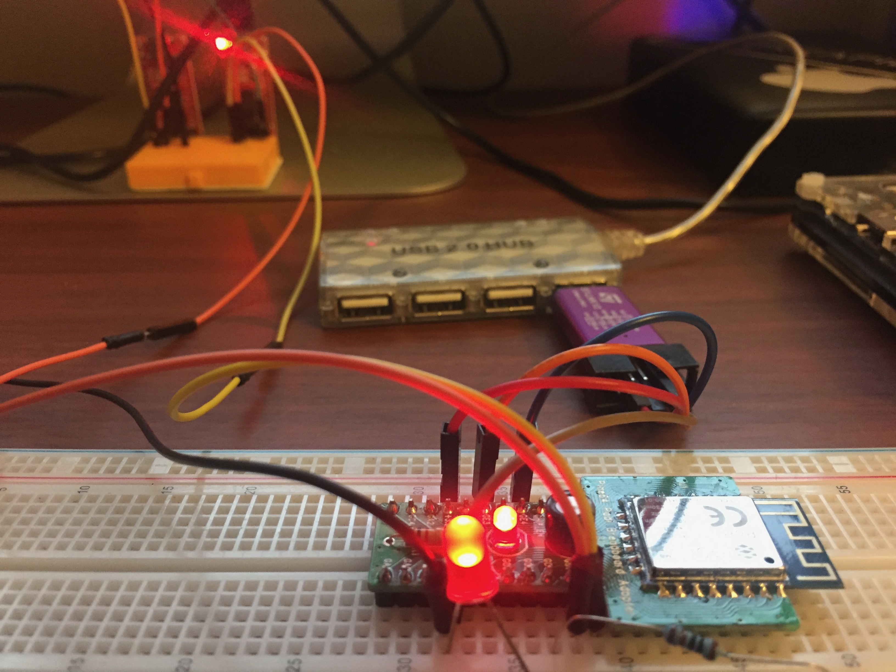

# Installation

This is an Arduino board package for the PADI IoT Stamp.

The package simply builds off of the [Realtek Ameba Arduino](http://www.amebaiot.com/en/ameba-arduino-getting-started/) package.  Please install it beforehand.

Add:
```
https://github.com/gtalusan/PADIIoTStamp/raw/master/release/package_padiiotstamp_index.json
```
to your Arduino IDE and install the padiiotstamp package.

Install OpenOCD.  The `platform.txt` assumes it lives in `/usr/local/bin`.

The `platform.txt` also assumes you have an STLink V2 or compatible SWD debugger.  You can also change this in `platform.txt`.

NOTE: this has only been tested on `macOS Sierra`.  Buyer beware.

# Usage


## Blink

The typical Blink sketch runs great.  I have the LED wired to GC1.

```
// the setup function runs once when you press reset or power the board
void setup() {
  // initialize digital pin LED_BUILTIN as an output.
  pinMode(LED_BUILTIN, OUTPUT);
}

// the loop function runs over and over again forever
void loop() {
  digitalWrite(LED_BUILTIN, HIGH);   // turn the LED on (HIGH is the voltage level)
  delay(1000);                       // wait for a second
  digitalWrite(LED_BUILTIN, LOW);    // turn the LED off by making the voltage LOW
  delay(1000);                       // wait for a second
}
```

## UART

UART pins are GB0 and GB1 at 38400 baud.

## Wi-Fi

The Ameba IOT example `ScanNetworks` runs right out of the box:

```
ROM Version: 0.3

Build ToolChain Version: gcc version 4.8.3 (Realtek ASDK-4.8.3p1 Build 2003) 

=========================================================
Check boot type form eFuse
SPI Initial
Image1 length: 0x3a88, Image Addr: 0x10000bc8
Image1 Validate OK, Going jump to Image1
BOOT from Flash:YES
SPI calibration
Find the avaiable window
===== Enter Image 1 ====elay start:0; Delay end:63
SPI calibration
Find the avaiable window
Baud:1; auto_length:11; Delay start:0; Delay end:63

load NEW fw 0
Flash Image2:Addr 0xb000, Len 220532, Load to SRAM 0x10006000
No Image3
Img2 Sign: RTKWin, InfaStart @ 0x10006049 
===== Enter Image 2 ====
interface 0 is initialized
interface 1 is initialized

Initializing WIFI ...
WIFI initialized
MAC: 0:E0:4C:87:0:0
Scanning available networks...
** Scan Networks **
number of available networks:13
0) BELL902	Signal: -71 dBm	EncryptionRaw: WPA2 AES	Encryption: WPA2
1) BELL881	Signal: -83 dBm	EncryptionRaw: WEP	Encryption: WEP
2) doghouse	Signal: -85 dBm	EncryptionRaw: WPA2 AES	Encryption: WPA2
3) hogwarts	Signal: -89 dBm	EncryptionRaw: WPA2 AES	Encryption: WPA2
4) Rogers10444	Signal: -89 dBm	EncryptionRaw: WPA/WPA2 AES	Encryption: WPA2
5) BELL700	Signal: -89 dBm	EncryptionRaw: WPA2 AES	Encryption: WPA2
6) 869952	Signal: -91 dBm	EncryptionRaw: WPA/WPA2 AES	Encryption: WPA2
7) dlink-01D5	Signal: -91 dBm	EncryptionRaw: WPA/WPA2 AES	Encryption: WPA2
8) That Girl T	Signal: -93 dBm	EncryptionRaw: WPA2 AES	Encryption: WPA2
9) JROY2016	Signal: -95 dBm	EncryptionRaw: WPA/WPA2 AES	Encryption: WPA2
10) OnyxLion-guest	Signal: -95 dBm	EncryptionRaw: Open	Encryption: None
11) Venture Headquarters	Signal: -95 dBm	EncryptionRaw: WPA/WPA2 AES	Encryption: WPA2
12) BELL842	Signal: -95 dBm	EncryptionRaw: WPA2 AES	Encryption: WPA2
```

## Links

[rebane's OpenOCD rtl8170 flasher](https://bitbucket.org/rebane/rtl8710_openocd/src)
[PADI IoT Stamp pin out](http://files.pine64.org/doc/PADI/documentation/padi-pinout-diagram.pdf)
[Ameba IoT Getting Started](http://www.amebaiot.com/en/ameba-arduino-getting-started/)
